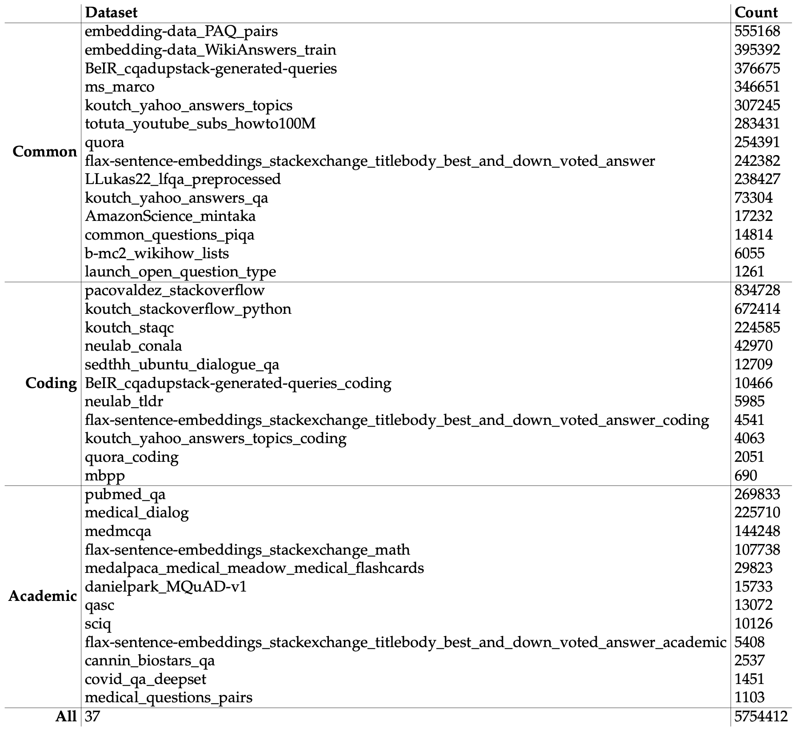

## SELF-J: Selective Instruction Following with Alignment Self-Evaluation

This repository contains the code for our paper [SELF-J: Selective Instruction Following with Alignment Self-Evaluation](). 


## Quick Start
We provide one of our trained judge models and the code of generating quality scores with the judge model for evaluation. 

#### Setup
We base on `vLLM` for inference, so you have to refer [here](https://docs.vllm.ai/en/latest/getting_started/installation.html) to install vLLM if you don't have. 

#### Inference
We provide the inference code in `judge.py`. To get the score, run:
```bash
python judge.py
```

#### Model
We release our judge model, tuned for the instruction-following model of Vicuna-v1.5, at Huggingface, link: [Self-J-13B-Vicuna-v1.5](https://huggingface.co/oceanpty/Self-J). 


## Judge Model Tuning
Our training code for judge modeling is based on the project of [Alpaca-Lora](https://github.com/tloen/alpaca-lora), so you will have to first follow the original instructions to set up the environment. 


#### Training Data
We provide the example training data for tuning the judge model at Huggingface, where the evaluated model is Vicuna-v1.5 and the qulaity score is the combination of model's self-evaluation and cosine similarity. 

1. Data with reference answer: [data_w_ref](https://huggingface.co/datasets/oceanpty/self-j/blob/main/training_set.round1.cosine_reivew.w_ref.category%3D1-10.review_by_vicuna-13b-v1.5.base_model%3Dvicuna-13b-v1.5.num%3D30k.json). 

2. Data without reference answer: [data_wo_ref](https://huggingface.co/datasets/oceanpty/self-j/blob/main/training_set.round1.cosine_reivew.wo_ref.category%3D1-10.review_by_vicuna-13b-v1.5.base_model%3Dvicuna-13b-v1.5.num%3D30k.json). 


## Instruction Collection
We collect a large-scale of instructions to study alignment evaluation on generation tasks, such as coding, writing, etc. We manually filtered datasets from Hugging Face as of June 2023, particularly those in the NLP category. 
We post-processed the datasets to filter out low-quality instructions as much as possible. 
We retained all good-quality instructions. We removed instructions that were either too short or too long. We also used the original instructions without tokenization, paraphrasing, etc, to maintain the real distribution of the instructions. After sorting, we keep 37 datasets in total. We manually categorized the datasets into three main categories: common, coding, and academic. Common instructions mainly concern everyday matters, such as seeking advice and solving technical problems. All instructions involving coding such as code generation and debugging are classified under the coding category. Lastly, subject-specific instructions, such as science and medicine, are categorized as academic. 




