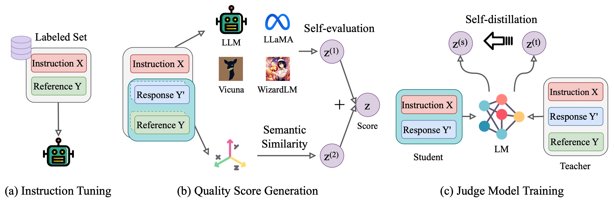

# SELF-J

This repository contains the code for our paper [Self-Judge: Selective Instruction Following with Alignment Self-Evaluation](). 


## Quick Links
  - [Overview](#overview)
  - [Quick Start](#quick-start)
    - [1. Setup](#1-setup)
    - [2. Inference](#2-inference)
    - [3. Model](#3-model)
    - [4. Performance](#4-performance)
  - [Judge Model Tuning](#judge-model-tuning)
    - [1. Training Data](#1-training-data)
    - [2. Script](#2-script)
  - [Instruction Collection](#instruction-collection)
    - [1. Statistics](#1-statistics)
    - [2. Data Release](#2-data-release)
    - [3. Performance: AlpacaEval](#3-performance-alpacaeval)


## Overview
To address inaccuracies in large language models (LLMs) when executing instructions, the concept of selective instruction following is proposed. This method involves models declining tasks when expected response quality is low, improving reliability.

A new self-training framework, Self-J, is introduced to develop judge models that assess response quality without human-annotated data. These models use the model’s inherent evaluation abilities and a gold reference for self-calibration.

The models are validated using high-quality data from Hugging Face and tested extensively, showing strong correlation with advanced models like GPT-4 and superior performance across different domains.

The judge models not only enhance performance in specific benchmarks but also rank 95 models from AlpacaEval, demonstrating high correlation with GPT-4. This underscores the potential of alignment self-evaluation in improving LLMs.





## Quick Start
We provide one of our trained judge models and the code of generating quality scores with the judge model for evaluation. 

#### 1. Setup
We base on `vLLM` for inference, so you have to refer [here](https://docs.vllm.ai/en/latest/getting_started/installation.html) to install vLLM if you don't have. 

#### 2. Inference
We provide the inference code in `judge.py`. To get the score, run:
```bash
python judge.py
```

#### 3. Model
We release our judge model, tuned for the instruction-following model of Vicuna-v1.5, at Huggingface, link: [Self-J-13B-Vicuna-v1.5](https://huggingface.co/oceanpty/Self-J). 

#### 4. Performance
Our judge models achieve better correlations with GPT-4 than strong baselines. However, it can still suffer from the issue of distribution shifts.

**Pearson correlation between various measures with GPT-4's scores. Assessment based on 850 test samples**

| Method                  | Ours-13b | Vicuna-13b | Wizardlm-13b | Llm2-13b-chat | Llm2-70b-chat | Avg.   |
|-------------------------|----------|------------|--------------|---------------|---------------|--------|
| *With reference*      |          |            |              |               |               |        |
| Cosine                  | 39.75    | 42.81      | 40.81        | 59.04         | 58.82         | 48.25  |
| Self-eval               | 44.66    | 55.13      | 48.52        | 40.26         | 50.70         | 47.85  |
| Self-eval + Cosine      | 53.19    | 60.77      | 55.69        | 64.72         | 65.51         | 59.98  |
| GPT-3.5-turbo           | 66.41    | 66.58      | 69.96        | 73.35         | 75.81         | 70.42  |
| GPT-3.5-turbo + Cosine  | **68.33**| 69.99      | **70.90**    | **78.13**     | **78.12**     | 73.09  |
| Self-J (ours)           | 66.75    | **70.95**  | 69.56        | 72.76         | 71.70         | 70.34  |
| *Without reference*   |          |            |              |               |               |        |
| PPL                     | 13.22    | 13.46      | 6.47         | 29.25         | -3.99         | 11.68  |
| VRO                     | 45.20    | 40.03      | 38.24        | 40.66         | 41.47         | 41.12  |
| Self-eval               | 1.23     | 15.19      | 12.75        | 12.13         | 15.99         | 11.46  |
| GPT-3.5-turbo           | 15.21    | 25.98      | 19.07        | 20.05         | 22.78         | 20.62  |
| Auto-J-13b              | 37.02    | 39.68      | 37.88        | 53.71         | 49.43         | 43.54  |
| UltraRM-13b             | 43.50    | 44.18      | 50.68        | 63.83         | 62.69         | 52.98  |

*Judge Models-13b Results*

| Judge Model               | Ours-13b | Vicuna-13b | Wizardlm-13b | Llm2-13b-chat | Llm2-70b-chat | Avg.   |
|---------------------------|----------|------------|--------------|---------------|---------------|--------|
| Judge (Cosine)            | 39.73    | 38.78      | 39.21        | 61.20         | 58.06         | 47.40  |
| Judge (Self-eval)         | 45.02    | 45.14      | 43.61        | 48.13         | 44.57         | 45.29  |
| Self-J (ours)             | 56.94    | 56.67      | 53.10        | 64.87         | 61.65         | 58.65  |


## Judge Model Tuning
Our training code for judge modeling is based on the project of [Alpaca-Lora](https://github.com/tloen/alpaca-lora), so you will have to first follow the original instructions to set up the environment. 


#### 1. Training Data
We provide the example training data for tuning the judge model at Huggingface, where the evaluated model is Vicuna-v1.5 and the qulaity score is the combination of model's self-evaluation and cosine similarity. 

1. Data with reference answer: [data_w_ref](https://huggingface.co/datasets/oceanpty/self-j/blob/main/training_set.round1.cosine_reivew.w_ref.category%3D1-10.review_by_vicuna-13b-v1.5.base_model%3Dvicuna-13b-v1.5.num%3D30k.json). 

2. Data without reference answer: [data_wo_ref](https://huggingface.co/datasets/oceanpty/self-j/blob/main/training_set.round1.cosine_reivew.wo_ref.category%3D1-10.review_by_vicuna-13b-v1.5.base_model%3Dvicuna-13b-v1.5.num%3D30k.json). 

#### 2. Script
To train the judge model, run
```bash
cd bash
bash finetune.kd.sh
```


## Instruction Collection
### 1. Statistics
We collect a large-scale of instructions to study alignment evaluation on generation tasks, such as coding, writing, etc. We manually filtered datasets from Hugging Face as of June 2023, particularly those in the NLP category. 
We post-processed the datasets to filter out low-quality instructions as much as possible. 
We retained all good-quality instructions. We removed instructions that were either too short or too long. We also used the original instructions without tokenization, paraphrasing, etc, to maintain the real distribution of the instructions. After sorting, we keep 37 datasets in total. We manually categorized the datasets into three main categories: common, coding, and academic. Common instructions mainly concern everyday matters, such as seeking advice and solving technical problems. All instructions involving coding such as code generation and debugging are classified under the coding category. Lastly, subject-specific instructions, such as science and medicine, are categorized as academic. 


### 2. Data Release
We have released the collection of instructions, and you can download the data from Huggingface at [instruction-5.7m](https://huggingface.co/datasets/oceanpty/Self-J/blob/main/large_scale_instruction_collection.num%3D5754412.jsonl). 


### 3. Performance: AlpacaEval
By fine-tuning Llama-2-13b with random 87K of our instruction selections and
GPT-3.5 Turbo responses, we can match Llama-2-13b-Chat's performance on AlpacaEval.
| Models | V1 | v2 |
| :------------- | :----------------: | :--------: | 
|Vicuna 13B v1.5    |  - | 6.7 |
| Llama-2-13B-Chat    |  81.09 |     7.7    |    
| Ours-Llama-2-13B     |  79.13  |     7.33     |   


